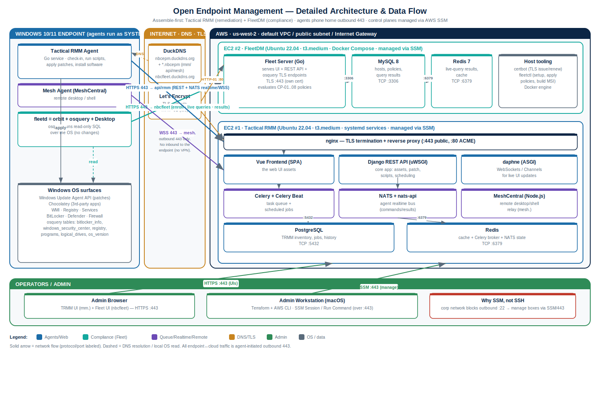

# Architecture & Data Flow (Detailed)

Deep-dive reference for technical discussions: every component, the protocols/ports on each
link, and the end-to-end data flows. Companion to [design.md](design.md) (which has the
higher-level overview) and the deployment guide.

> Source: [`diagrams/build_architecture_detailed.py`](diagrams/build_architecture_detailed.py)
> (regenerates the SVG). draw.io can import the SVG as a starting canvas.

---

## 1. The two planes

This is an **assemble-first** stack: two independent open-source systems, each best-in-class
at one half of the job, with the endpoint running an agent for each.

| Plane | Tool | Job | Endpoint agent |
|---|---|---|---|
| **Remediation** ("fix") | **Tactical RMM** | inventory, run scripts, **push patches**, deploy software, remote control | Tactical RMM agent (+ Mesh agent) |
| **Compliance** ("prove") | **FleetDM** | osquery-based visibility + **pass/fail policy** posture | `fleetd` (osquery) |

Both run on their own EC2 instance with their own DNS name + TLS cert. Endpoints **phone home
outbound over 443** — no inbound to the endpoint, so roaming laptops work without VPN.

## 2. Component inventory

### Endpoint (Windows 10/11) — all agents run as SYSTEM
| Component | What it is | Talks to |
|---|---|---|
| **Tactical RMM agent** | Go service; check-in, runs scripts, drives Windows Update + Chocolatey | `api/rmm.<domain>` 443 + NATS |
| **Mesh agent** | MeshCentral agent for remote desktop/shell | `mesh.<domain>` 443 (WSS) |
| **fleetd** | `orbit` (updater) + **osquery** + Fleet Desktop; runs read-only SQL over the OS | `<fleet-host>` 443 |
| **OS surfaces** | Windows Update Agent API, Chocolatey, WMI, Registry, Services, BitLocker/Defender/Firewall | local (read by osquery; written by TRMM agent) |

### EC2 #1 — Tactical RMM (Ubuntu 22.04, t3.medium, systemd)
| Component | Role | Port |
|---|---|---|
| **nginx** | TLS termination + reverse proxy; routes rmm/api/mesh | 443 (public), 80 (ACME) |
| **Vue frontend** | Web UI (SPA), served by nginx | via nginx |
| **Django REST API (uWSGI)** | Core app: assets, patching, scripts, scheduling, auth | local (behind nginx) |
| **daphne (ASGI)** | WebSockets / Django Channels for live UI | local |
| **Celery + Celery Beat** | Async task queue + scheduled jobs (patch runs, checks) | via Redis |
| **NATS + nats-api** | Realtime bus to agents (commands/results) | 4222 / ws 9235 (proxied via 443) |
| **MeshCentral (Node.js)** | Remote desktop/shell relay (`mesh.`) | via nginx |
| **PostgreSQL** | TRMM data (inventory, jobs, history) | 5432 (local) |
| **Redis** | Cache + Celery broker + NATS state | 6379 (local) |

### EC2 #2 — FleetDM (Ubuntu 22.04, t3.medium, Docker Compose)
| Component | Role | Port |
|---|---|---|
| **Fleet server (Go)** | UI + REST API + osquery TLS endpoints; evaluates CP-01…08 | 443 (own cert) |
| **MySQL 8** | Hosts, policies, query results | 3306 (container net) |
| **Redis 7** | Live-query results, caching | 6379 (container net) |
| **Host tooling** | certbot (TLS), fleetctl (setup/policies/MSI build), Docker engine | — |

### DNS / TLS / Admin
| Component | Role |
|---|---|
| **DuckDNS** | `nbcepm` (+ wildcard `rmm/api/mesh`) → TRMM EIP; `nbcfleet` → Fleet EIP |
| **Let's Encrypt** | TLS certs via HTTP-01 (port 80) |
| **AWS SSM** | Manage both instances over 443 (no SSH — corp net blocks 22) |
| **Admin browser / workstation** | UIs over 443; Terraform + AWS CLI + SSM from macOS |

## 3. Port / protocol matrix (the firewall view)

| From | To | Port | Proto | Direction | Purpose |
|---|---|---|---|---|---|
| Endpoint agents | TRMM / Fleet hosts | **443** | HTTPS / WSS | outbound (agent-initiated) | check-in, telemetry, jobs, osquery, remote |
| Let's Encrypt | TRMM / Fleet | **80** | HTTP | inbound | ACME HTTP-01 (issue/renew only) |
| Admin browser | TRMM / Fleet | **443** | HTTPS | inbound | web UIs |
| Instances | AWS SSM endpoints | **443** | HTTPS | outbound | SSM management channel |
| nginx | Django/Mesh | local | — | in-box | reverse proxy |
| Django/Celery | PostgreSQL / Redis | 5432 / 6379 | TCP | in-box | data + queue |
| Django | NATS | 4222 / 9235 | TCP/ws | in-box | agent realtime |
| Fleet | MySQL / Redis | 3306 / 6379 | TCP | in-box (container) | data + cache |

**Security-group inbound:** 443 (`0.0.0.0/0`, agents) · 80 (`0.0.0.0/0`, ACME) · 4222
(`0.0.0.0/0`, TRMM NATS — belt-and-suspenders; modern agents use 443/WSS) · 22 (admin IP /32,
break-glass only — SSM is the real path). Everything else is in-box / container-internal.

## 4. Data-flow walkthroughs

**A. Enrollment (TRMM)** — installer runs `tacticalrmm.exe -m install` with the API URL +
auth token → registers over 443 → server issues an agent ID, creates the Windows service,
installs the Mesh agent. (fleetd enrolls separately via its MSI's baked-in URL + enroll secret.)

**B. Inventory / telemetry** — TRMM agent posts hardware/OS/software/patch status on its
check-in interval (443). Independently, fleetd's osquery answers Fleet's scheduled queries and
returns rows (443).

**C. Compliance (Fleet)** — Fleet sends each CP-01…08 policy as an osquery query; the host
runs it locally (e.g. `SELECT … FROM bitlocker_info …`) and returns rows; **rows ⇒ pass**.
Per-host results are immediate; fleet-wide aggregate counts update on a background cron.

**D. Patch push (TRMM)** — admin approves updates in the UI → Django queues a job → delivered
to the agent over **NATS (realtime, via 443)** → agent calls the **Windows Update Agent API**
to download/install → reports status back; reboot honors the configured policy.

**E. Software deploy (TRMM)** — admin selects a package → job to agent → agent runs
**Chocolatey** to install → software inventory refreshes on the next scan.

**F. Remote control (Mesh)** — admin opens a session in the UI → MeshCentral relays a WSS
connection (`mesh.`, 443) to the Mesh agent → screen/shell. No inbound port on the endpoint.

**G. Admin / management (SSM)** — operator's macOS runs Terraform/AWS CLI and SSM
Session/Run-Command, all over the **AWS API on 443**; the instances' SSM agents hold an
outbound channel to SSM. **No public SSH** — the corp network blocks outbound 22, which is the
whole reason this design leans on SSM.

## 5. Trust & blast radius (for the security conversation)

- The control planes can **execute code as SYSTEM on every enrolled endpoint** (that's the
  point of an RMM). So the TRMM box is the highest-value target: compromise = fleet-wide RCE.
  Mitigations on the roadmap: IP-allowlist the admin UIs, MFA, audit logging, secrets in a
  manager. See [roadmap.md](roadmap.md).
- Endpoints expose **no inbound ports** — all comms are agent-initiated outbound 443, so a
  roaming laptop is never directly reachable.
- TLS everywhere (Let's Encrypt); agents validate the server cert chain.
- Data at rest: EBS volumes are encrypted. Backups are a roadmap item (P1).
